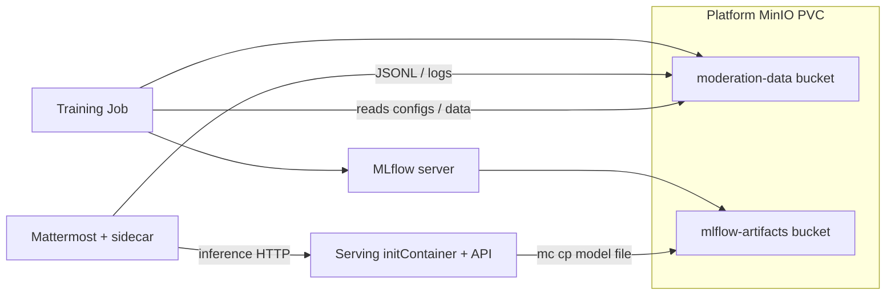

# Master plan: Chameleon, GitOps, and app data plane

This is the **target architecture** for the Mattermost MLOps project, aligned with the class **MLOps on Chameleon** lab (Terraform → configure cluster → Argo CD / workflows), with room for **Kubespray** (Ansible) when you need a **multi-node** self-managed cluster instead of a single **K3s** node.

---

## 1. Layers (order of concern)

| Layer | Responsibility | Tooling in this repo |
| --- | --- | --- |
| **A. Capacity** | Blazar leases, flavors, time windows | Chameleon Horizon / CLI; **not** Terraform (provider gap) |
| **B. Day 0 IaaS** | Servers, FIP, Cinder volume, security groups | `infrastructure/terraform/` |
| **C. Day 0.5 install** | Kubernetes on those servers (single- or multi-node) | `scripts/bootstrap-k8s.sh` (K3s) **or** `infrastructure/ansible/kubespray/` (multi-node) |
| **D. Day 1 platform** | Namespaces, ingress, storage, **MinIO + MLflow**, shared secrets contract | `infrastructure/k8s/` (YAML + future Kustomize overlays) |
| **E. Day 1 apps** | Mattermost+Postgres, model **serving**, **training** Jobs/CronJobs | `k8s/apps/`, `k8s/mattermost/`, `k8s/platform/` |
| **F. Day 2 GitOps** | Declarative sync, promotions staging → canary → prod | Argo CD (see `k8s/gitops/`) + CI (build/push images, optional update bot) |
| **G. Pipelines** | Retrain, batch scoring, MLOps glue | Argo **Workflows** (optional), CronJobs, or CI **after** the cluster and registry are stable |

You implement **A → B → C** once per rebuild; **D → E** from Git; **F** makes **D–E** continuous and team-driven.

---

## 2. What to reserve on Chameleon (you bring us)

**Always**

- A Blazar **lease** that covers the **instance flavor** you will use (e.g. `m1.large`) for the whole experiment window.
- The reservation **`flavor_id`** (UUID) for each **flavor:instance** reservation (Terraform `reservation_id`, not the lease name).

**Single node (current default: K3s on one VM)**

- **1×** `flavor:instance` reservation for the bootstrap node (large enough for K3s + Mattermost + MinIO/MLflow + serving).

**Multi-node (Kubespray, lab-style 3 workers)**

- **3×** (or 2 control plane + n worker per Kubespray design) **instance** reservations on flavors that **fit your quota and RAM/CPU** plan; **or** one lease with **multiple** instance reservations of the same flavor, subject to Chameleon/Blazar UI.
- A **private network** segment if the lab uses one (GourmetGram uses `192.168.1.0/24` + router); this repo’s Terraform today uses **sharednet1**; expanding to a private tenant network is a **Phase-2 Terraform** change if you mirror the lab.

**OpenStack for automation**

- **Application credentials** in `clouds.yaml` (Terraform and optionally Ansible `openstack` dynamic inventory if you add it).
- A **keypair** registered in KVM@TACC matching your SSH key (Terraform `keypair_name`).

---

## 3. How apps are built, stored, and run

| App | Build source | **Container** artifact lives in | Runs as |
| --- | --- | --- | --- |
| Mattermost (fork) | `server/build/Dockerfile.mlops` | **Registry** (GHCR) or `docker load` on node | `Deployment` in `k8s/mattermost/` |
| Model **serving** API | `Dockerfile.serving` / `serving/` | **Registry** (image digest/tag) | `Deployment` in `k8s/apps/serving/` |
| **Training** | `Dockerfile.training` / `training/` | **Registry** | `Job` + `CronJob` in `k8s/apps/training/` |
| **MinIO** | Upstream image | *Pull* from Docker Hub (no project build) | `Deployment` in `k8s/platform/` |
| **MLflow** | Upstream + args | *Pull* | `Deployment` in `k8s/platform/` |
| **Postgres** (Mattermost) | `postgres:15` | *Pull* | `StatefulSet` in `k8s/mattermost/` |

**MLflow** is **not** a container registry. It **tracks** runs and (with MinIO) **stores artifact files** (e.g. `joblib` under `s3://mlflow-artifacts/...`). The **serving** pod still uses a **normal container image** for Python/Uvicorn; the **initContainer** fetches the **artifact URI** (S3) into `emptyDir`.

---

## 4. Data flow (MinIO + MLflow + Mattermost)

- **MLflow** backend store: **SQLite** on a PVC in this repo; **artifact root**: `s3://mlflow-artifacts/` on MinIO.
- **Mattermost** sidecar: mirrors moderation logs to `moderation-data` (see `k8s/mattermost/mattermost-deployment.yaml`).
- **Training**: reads S3 paths from your configs; logs to `MLFLOW_TRACKING_URI`.
- **Serving**: `MODEL_S3_URI` should resolve to a **concrete object** in MinIO (often an MLflow-produced path under `mlflow-artifacts/`).

**Secrets:** the same **logical** MinIO user/password is replicated to each namespace that needs S3 access (`infrastructure/secrets.env` + `create-secrets.sh`).

---

## 5. Three environments (staging / canary / prod)

**Conventions (target)**

| Concern | Convention |
| --- | --- |
| Git | `overlays/staging`, `overlays/canary`, `overlays/prod` (Kustomize) **or** three Helm value files |
| Runtime | **Same cluster** initially: separate **namespaces** (e.g. `mattermost-staging`, `mattermost-prod`, …) **or** one namespace with labels and NetworkPolicy (pick one; namespaces are easier for RBAC) |
| Images | **Different tags** per env (`:staging-abc`, `:canary-xyz`, `:v1.2.3`); Argo or CI applies |
| ingress | e.g. `mm-staging.<FIP-nip>`, `mm.<FIP-nip>`, or host/path routing |

**Chameleon** does not require **three VMs** for three logical envs. Add VMs when you need **isolation** or **capacity**, not to “count” three environments.

---

## 6. GitOps and DevOps order of work (recommended)

1. **Stable IaaD:** Terraform outputs + **documented** FIP; `set-floating-ip-in-manifests.sh` after every FIP change.
2. **Stable cluster:** K3s **or** Kubespray; **one** `kubeconfig` in CI and for admins.
3. **Stable platform:** MinIO + MLflow + secrets; prove **one** training run and **one** artifact in MinIO.
4. **Stable apps:** serving + Mattermost + inference URL; end-to-end message → log → MinIO (existing scripts).
5. **Argo CD:** install; `Application` per env or app-of-apps; source = this repo + overlay path.
6. **CI:** build and push on merge; tag convention; (optional) Argo Image Updater.
7. **Hardening:** backups, resource quotas, network policies, TLS.

`k8s/gitops/` holds install notes and example **Application** manifests; keep secrets **out of Git** (use sealed-secrets, External Secrets, or `kubectl` + `create-secrets.sh` in bootstrap).

---

## 7. Kubespray vs K3s (when to use which)

| | **K3s** (`scripts/bootstrap-k8s.sh`) | **Kubespray** (`ansible/kubespray/`) |
| --- | --- | --- |
| **Use** | Fast bring-up, single node, class demos, minimal ops | **Multi-node** HA-ish cluster, close to the MLOps **lab** topology |
| **Cost** | 1 instance | ≥3 instances + more lease complexity |
| **This repo** | **Default** today | **Documented** path; add submodule and inventory, run upstream playbook from Ansible control node |

---

## 8. Conventions: naming and file layout (post-refactor)

- `infrastructure/k8s/` — all in-cluster YAML (replaces the old `kubernetes/` name to avoid confusion with “Kubernetes the project”).
- `infrastructure/k8s/apps/serving/`, `.../apps/training/` — first-class app workloads (no “stub” directory name; images may still be examples until registry is final).
- `infrastructure/ansible/` — optional automation; **Kubespray** lives under `ansible/kubespray/README.md` with upstream instructions.

---

## 9. Rollback

If a refactor or apply goes wrong, see [ROLLBACK-BASELINE.md](ROLLBACK-BASELINE.md) for a pinned commit.

---

*Last updated: as part of the infrastructure rearchitecture pass.*
